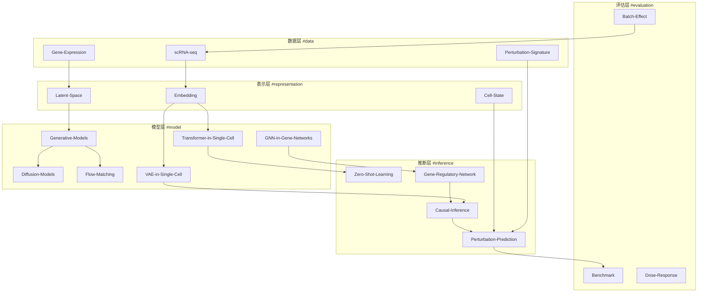
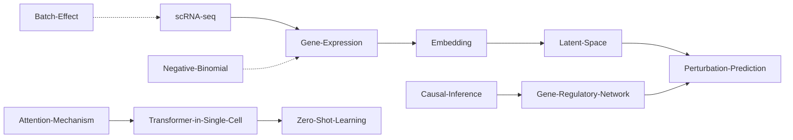
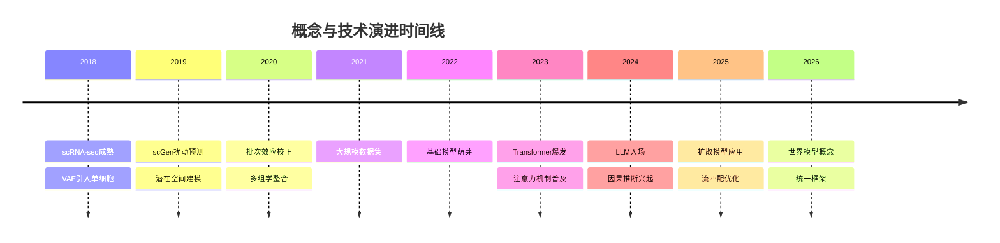

# 💡 概念总地图 (Concepts MOC)

> **AIVC 核心概念网络与知识图谱**
> 
> 本知识库收录 **29** 个核心概念，构建完整的 Perturbation 预测知识体系

---

## 🕸️ 概念网络图



---

## 📚 核心概念分类

### 🧬 基础概念 #concept/fundamental

单细胞与基因表达分析的基础知识

| 概念 | 描述 | 关键链接 | 标签 |
|-----|------|---------|------|
| [[scRNA-seq\|单细胞RNA测序]] | 单细胞转录组测序技术基础 | [[02-Methods/scVI\|scVI]], [[02-Methods/scGen\|scGen]] | #sequencing #transcriptomics |
| [[Gene-Expression\|基因表达]] | 基因表达定量与归一化 | [[scRNA-seq]], [[Embedding]] | #expression #quantification |
| [[Cell-State\|细胞状态]] | 细胞类型与状态定义 | [[Perturbation-Signature]], [[Latent-Space]] | #cell-type #state |
| [[Perturbation-Signature\|扰动特征]] | 扰动响应的分子特征 | [[Gene-Expression]], [[Dose-Response]] | #perturbation #signature |
| [[Negative-Binomial\|负二项分布]] | 单细胞计数数据的统计建模 | [[scVI]], [[scGen]] | #statistics #distribution |

---

### 🔗 表示学习 #concept/representation

细胞与基因的向量表示方法

| 概念 | 描述 | 关键链接 | 标签 |
|-----|------|---------|------|
| [[Embedding\|嵌入]] | 细胞与基因的低维表示 | [[scBERT]], [[Geneformer]] | #embedding #representation |
| [[Latent-Space\|潜在空间]] | VAE等模型的隐变量空间 | [[scVI]], [[scGen]] | #latent #vae |
| [[Attention-Mechanism\|注意力机制]] | Transformer核心组件 | [[scBERT]], [[scGPT]] | #attention #transformer |
| [[Batch-Effect\|批次效应]] | 技术噪声与数据整合 | [[scVI]], [[scANVI]] | #batch #integration |

---

### 🤖 模型架构 #concept/architecture

深度学习方法与模型家族

| 概念 | 描述 | 关键链接 | 标签 |
|-----|------|---------|------|
| [[VAE-in-Single-Cell\|单细胞VAE]] | 变分自编码器在单细胞中的应用 | [[scVI]], [[scGen]], [[CPA]] | #vae #generative |
| [[Transformer-in-Single-Cell\|单细胞Transformer]] | 注意力机制在基因建模中的应用 | [[scBERT]], [[scGPT]], [[CellFM]] | #transformer #attention |
| [[GNN-in-Gene-Networks\|基因网络GNN]] | 图神经网络建模基因关系 | [[GEARS]], [[Cell_Oracle]] | #gnn #network |
| [[Generative-Models\|生成模型]] | 生成式AI方法概览 | [[Diffusion-Models]], [[Flow-Matching]] | #generative #ai |
| [[Diffusion-Models\|扩散模型]] | 去噪扩散概率模型 | [[X-Cell]], [[scDiffusion-Perturb]] | #diffusion #generative |
| [[Flow-Matching\|流匹配]] | 连续归一化流与最优传输 | [[CellFlow]], [[CFM-GP]] | #flow #ot |
| [[Optimal-Transport\|最优传输]] | 分布间映射的数学理论 | [[CellFlow]], [[CELLOT]] | #ot #math |

---

### 🔍 推断任务 #concept/inference

预测与推断的核心任务

| 概念 | 描述 | 关键链接 | 标签 |
|-----|------|---------|------|
| [[Perturbation-Prediction\|扰动预测]] | 预测扰动后的细胞状态 | [[scGen]], [[GEARS]], [[CPA]] | #prediction #perturbation |
| [[Causal-Inference\|因果推断]] | 因果效应估计与发现 | [[scCausalVI]], [[CausCell]] | #causal #inference |
| [[Gene-Regulatory-Network\|基因调控网络]] | GRN推断与建模 | [[SCENIC]], [[Cell_Oracle]] | #grn #network |
| [[Zero-Shot-Learning\|零样本学习]] | 未见扰动的预测能力 | [[PertAdapt]], [[scUnify]] | #zero-shot #generalization |
| [[Combinatorial-Perturbation\|组合扰动]] | 多因素联合效应预测 | [[CPA]], [[GPerturb]] | #combinatorial #multi |
| [[Dose-Response\|剂量响应]] | 剂量-效应关系建模 | [[Dose-Response-Modeling]] | #dose #response |

---

### 📊 评估与基准 #concept/evaluation

方法评估与标准化

| 概念 | 描述 | 关键链接 | 标签 |
|-----|------|---------|------|
| [[Benchmark\|基准测试]] | 标准化评估流程 | [[Systema]], [[Nature-Methods-Benchmark]] | #benchmark #evaluation |
| [[terminology-standard\|术语标准]] | 领域术语规范化 | [[04-Concepts/terminology-standard\|术语标准]] | #terminology #standard |

---

## 🔗 概念关系网络

### 核心依赖关系



### 技术演进路径



---

## 🏷️ 标签体系

### 按类型标签

- `#concept/fundamental` - 基础概念
- `#concept/representation` - 表示学习
- `#concept/architecture` - 模型架构
- `#concept/inference` - 推断任务
- `#concept/evaluation` - 评估基准

### 按技术标签

- `#vae` - 变分自编码器
- `#transformer` - Transformer架构
- `#gnn` - 图神经网络
- `#diffusion` - 扩散模型
- `#flow` - 流匹配
- `#llm` - 大语言模型
- `#causal` - 因果推断

### 按应用标签

- `#perturbation` - 扰动预测
- `#prediction` - 预测任务
- `#grn` - 基因调控网络
- `#embedding` - 嵌入学习
- `#benchmark` - 基准测试

---

## 🔍 概念查询示例

### Dataview 查询

```dataview
// 查找所有模型架构相关概念
table description, key-methods
from "04-Concepts"
where contains(tags, "#concept/architecture")
sort title asc
```

```dataview
// 查找与因果推断相关的所有概念
list
from "04-Concepts"
where contains(file.outlinks, [[Causal-Inference]])
```

```dataview
// 按标签统计概念数量
TABLE length(rows) as Count
FROM "04-Concepts"
GROUP BY tags
```

---

## 🎯 学习路径推荐

### 初学者路径

1. **基础概念** → [[scRNA-seq]] → [[Gene-Expression]] → [[Cell-State]]
2. **表示学习** → [[Embedding]] → [[Latent-Space]] → [[Batch-Effect]]
3. **入门方法** → [[scVI]] → [[scGen]] → [[GEARS]]

### 进阶路径

1. **深度学习** → [[Attention-Mechanism]] → [[Transformer-in-Single-Cell]]
2. **生成模型** → [[VAE-in-Single-Cell]] → [[Diffusion-Models]] → [[Flow-Matching]]
3. **前沿方向** → [[Causal-Inference]] → [[Zero-Shot-Learning]] → [[Combinatorial-Perturbation]]

### 专家路径

1. **理论基础** → [[Optimal-Transport]] → [[Causal-Inference]]
2. **大规模方法** → [[CellFM]] → [[X-Cell]] → [[STATE]]
3. **评估体系** → [[Benchmark]] → [[terminology-standard]]

---

## 🔗 相关MOC

- [[Methods-MOC]] - 方法总地图
- [[Getting-Started]] - 入门指南
- [[01-Maps/concept-map\|概念地图]] - 可视化概念网络
- [[04-Concepts/method-relationship-graph\|方法关系图]] - 方法间关系

---

*最后更新: 2026-03-31 | 概念数量: 29*