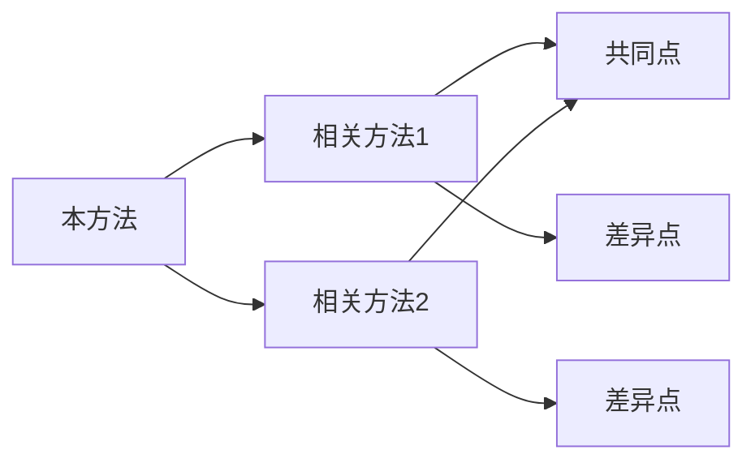

# 📝 日常笔记模板 (Daily Notes Template)

> **Obsidian 日常笔记模板，用于记录 AIVC 知识库的学习与研究进展**

---

## 基础模板

```markdown
---
tags: [daily-note, yyyy-mm-dd]
date: yyyy-mm-dd
---

# 📅 yyyy-mm-dd 学习笔记

## 🎯 今日目标
- [ ] 目标1
- [ ] 目标2
- [ ] 目标3

---

## 📖 阅读记录

### 阅读的文档
| 文档 | 类型 | 关键收获 | 链接 |
|-----|------|---------|------|
| 文档名 | 方法/概念 | 一句话总结 | [[文档链接]] |

### 关键发现
- 发现1
- 发现2

---

## 🔬 研究进展

### 实验/分析
- 做了什么
- 结果如何
- 下一步计划

### 代码实现
```python
# 今日编写的代码片段
```

---

## 💡 新理解/洞察

### 概念理解
- 对 [[某个概念]] 的新理解

### 方法洞察
- 对 [[某个方法]] 的新认识

### 关联发现
- 发现 [[A]] 与 [[B]] 的关系

---

## ❓ 问题与疑问

### 待解决的问题
- [ ] 问题1
- [ ] 问题2

### 需要进一步探索
- [ ] 探索方向1
- [ ] 探索方向2

---

## 🔗 相关链接

### 今日创建/修改的文档
- [[新文档1]]
- [[新文档2]]

### 参考资源
- [外部链接](url)
- [[内部文档]]

---

## 📊 今日统计

- 阅读文档数: X
- 新创建文档: X
- 修改文档数: X
- 解决问题数: X

---

*创建于: yyyy-mm-dd HH:MM*
```

---

## 专用模板

### 🔬 方法研读模板

用于深入研读特定方法时使用

```markdown
---
tags: [method-study, yyyy-mm-dd]
date: yyyy-mm-dd
---

# 🔬 方法研读: [[方法名]]

## 基本信息
- **方法名称**: 
- **发表年份**: 
- **发表期刊/会议**: 
- **作者团队**: [[团队名]]
- **代码链接**: 

---

## 核心思想 (一句话总结)


---

## 技术架构

### 输入
- 

### 输出
- 

### 关键组件
1. 
2. 
3. 

---

## 创新点

| 方面 | 创新 | 相比前人的改进 |
|-----|------|---------------|
| 架构 | | |
| 训练 | | |
| 应用 | | |

---

## 与相关方法的比较



---

## 个人理解

### 优点
- 

### 局限
- 

### 适用场景
- 

### 不适用场景
- 

---

## 待验证问题

- [ ] 
- [ ] 

---

## 关联文档
- [[相关概念1]]
- [[相关方法1]]
- [[相关方法2]]
```

---

### 💡 概念学习模板

用于学习新概念时使用

```markdown
---
tags: [concept-study, yyyy-mm-dd]
date: yyyy-mm-dd
---

# 💡 概念学习: [[概念名]]

## 定义


---

## 直观理解

用类比或例子解释...

---

## 数学形式 (如有)


---

## 在领域中的应用

### 相关方法
- [[方法1]] - 如何应用此概念
- [[方法2]] - 如何应用此概念

### 相关概念
- [[相关概念1]] - 关系说明
- [[相关概念2]] - 关系说明

---

## 常见误区

1. 误区1
   - 正确理解:

2. 误区2
   - 正确理解:

---

## 深入资源

- 论文: 
- 教程: 
- 代码: 
```

---

### 🔍 文献阅读模板

用于阅读研究论文时使用

```markdown
---
tags: [paper-reading, yyyy-mm-dd]
date: yyyy-mm-dd
---

# 📄 文献阅读: 论文标题

## 文献信息
- **标题**: 
- **作者**: 
- **年份**: 
- **期刊/会议**: 
- **DOI**: 
- **PDF路径**: 

---

## 研究背景

### 问题陈述


### 现有方法的局限


---

## 核心贡献

1. 
2. 
3. 

---

## 方法概述

### 技术路线


### 关键创新


---

## 实验结果

### 数据集
- 

### 主要结果
| 指标 | 本方法 | 基线1 | 基线2 |
|-----|-------|-------|-------|
| 指标1 | | | |
| 指标2 | | | |

### 消融实验


---

## 个人评价

### 优点
- 

### 缺点/局限
- 

### 可复现性评估
- [ ] 代码开源
- [ ] 数据公开
- [ ] 实验细节充分

---

## 与知识库的关联

### 可添加的方法/概念
- 

### 需要更新的文档
- 

### 相关现有文档
- [[相关文档1]]
- [[相关文档2]]
```

---

### 🧪 实验记录模板

用于记录计算实验时使用

```markdown
---
tags: [experiment, yyyy-mm-dd]
date: yyyy-mm-dd
---

# 🧪 实验记录: 实验名称

## 实验目的


---

## 实验设置

### 数据集
- 名称: 
- 来源: 
- 规模: 
- 预处理: 

### 方法/模型
- 名称: 
- 版本: 
- 超参数: 

### 环境
- Python版本: 
- 关键包版本: 
- GPU: 

---

## 实验过程

### 命令/代码
```bash
# 运行的命令
```

### 关键步骤
1. 
2. 
3. 

---

## 实验结果

### 定量结果
| 指标 | 数值 | 备注 |
|-----|------|------|
| | | |

### 定性观察
- 

### 可视化
![[输出图片.png]]

---

## 结果分析

### 主要发现
- 

### 意外发现
- 

### 问题与异常
- 

---

## 下一步计划

- [ ] 
- [ ] 

---

## 可复现性检查清单

- [ ] 代码已保存
- [ ] 随机种子已固定
- [ ] 超参数已记录
- [ ] 输出已归档
- [ ] 日志已保存
```

---

## 使用建议

### 日常习惯

1. **每日开始**: 复制当日日期模板，设定目标
2. **阅读时**: 使用方法研读或概念学习模板
3. **读论文时**: 使用文献阅读模板
4. **跑实验时**: 使用实验记录模板
5. **每日结束**: 更新进度，记录收获

### 标签建议

- `#daily-note` - 日常笔记
- `#method-study` - 方法研读
- `#concept-study` - 概念学习
- `#paper-reading` - 文献阅读
- `#experiment` - 实验记录
- `#idea` - 灵感记录

### 链接建议

- 使用 `[[文档名]]` 链接到知识库中的相关文档
- 使用 `#标签` 标记笔记类型
- 使用 `![[嵌入文档]]` 嵌入相关内容

---

## 🔗 相关MOC

- [[Methods-MOC]] - 方法总地图
- [[Concepts-MOC]] - 概念总地图
- [[Getting-Started]] - 入门指南
- [[About]] - 关于本知识库

---

*最后更新: 2026-03-31*