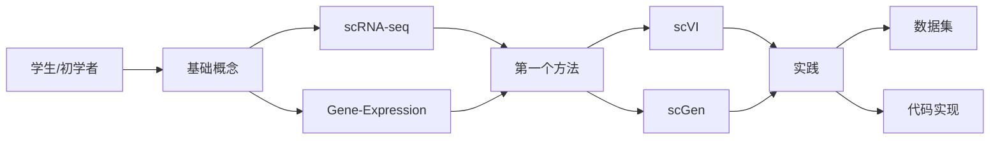

# 🚀 入门指南 (Getting Started)

> **欢迎来到 AIVC Perturbation 预测知识库！**
> 
> 本指南帮助不同背景的用户快速上手，找到最适合的学习路径

---

## 👥 不同角色的快速入口

### 🎓 学生/初学者

**你的背景**: 刚接触单细胞分析或计算生物学

**快速入口**:
1. 📖 **先读概念** → [[scRNA-seq]] 了解单细胞基础
2. 🧬 **理解任务** → [[Perturbation-Prediction]] 明确问题定义
3. 🔧 **学第一个方法** → [[02-Methods/VAE/scVI\|scVI]] VAE奠基之作
4. 📊 **动手实践** → [[05-Resources/scPerturb\|scPerturb]] 获取数据集

**推荐时长**: 2-3 周建立基础概念



---

### 🔬 生物研究人员

**你的背景**: 有湿实验经验，想了解计算方法

**快速入口**:
1. 💡 **理解价值** → [[Perturbation-Prediction]] 计算方法能做什么
2. 🎯 **选择方法** → [[04-Concepts/method-selection-guide\|方法选择指南]] 找到适合你数据的方法
3. 📊 **查看基准** → [[04-Concepts/method-comparison-matrix\|方法对比矩阵]] 横向比较
4. 🛠️ **获取工具** → [[05-Resources/code-implementations\|代码实现]] 找到可用代码

**关键问题**:
- "我有 Perturb-seq 数据，该用哪个方法？" → 查看 [[GEARS]] 或 [[CPA]]
- "想预测未见过的扰动效应？" → 查看 [[Zero-Shot-Learning]]
- "需要因果解释？" → 查看 [[CausCell]] 或 [[scCausalVI]]

---

### 💻 计算研究人员

**你的背景**: 有机器学习背景，想进入单细胞领域

**快速入口**:
1. 📚 **领域知识** → [[scRNA-seq]] + [[Batch-Effect]] 了解数据特性
2. 🏗️ **技术架构** → [[VAE-in-Single-Cell]] 或 [[Transformer-in-Single-Cell]]
3. 🔥 **前沿方法** → [[CellFM]] 或 [[X-Cell]] 了解最新进展
4. 📈 **评估标准** → [[Benchmark]] 了解领域评估规范

**技术映射**:
| 你的背景 | 对应单细胞方法 |
|---------|---------------|
| VAE/生成模型 | [[scVI]], [[scGen]], [[CPA]] |
| Transformer | [[scBERT]], [[scGPT]], [[CellFM]] |
| GNN | [[GEARS]], [[Cell_Oracle]] |
| 扩散模型 | [[X-Cell]], [[scDiffusion-Perturb]] |
| 流匹配 | [[CellFlow]], [[CFM-GP]] |
| LLM | [[CellHermes]], [[scMulan]] |

---

### 🏢 工业界研发人员

**你的背景**: 需要落地应用或开发产品

**快速入口**:
1. ⚡ **快速决策** → [[04-Concepts/method-selection-guide\|方法选择指南]]
2. 🏆 **成熟方法** → [[scGen]], [[GEARS]], [[CPA]] 经过验证的方案
3. 📦 **资源汇总** → [[05-Resources/Datasets\|数据集]] + [[code-implementations\|代码]]
4. ⚖️ **许可注意** → 检查各方法的开源许可协议

**生产环境建议**:
- **稳定性优先**: 选择有维护的成熟方法 ([[scGen]], [[GEARS]])
- **大规模数据**: 考虑 [[STATE]] 或 [[CellFM]]
- **实时推理**: 避免过于复杂的扩散模型
- **可解释性**: 选择 [[GEARS]] (知识图谱) 或因果方法

---

## 📚 推荐学习路径

### 路径 A: VAE 路线 (推荐初学者)

适合理解概率建模和生成模型的基础

```
Week 1: 基础概念
├── [[scRNA-seq]] - 单细胞测序基础
├── [[Gene-Expression]] - 基因表达分析
└── [[Negative-Binomial]] - 统计建模

Week 2: VAE 核心
├── [[VAE-in-Single-Cell]] - VAE架构理解
├── [[02-Methods/VAE/scVI\|scVI]] - 奠基方法
└── [[02-Methods/VAE/scGen\|scGen]] - 扰动预测首创

Week 3: 进阶应用
├── [[02-Methods/VAE/CPA\|CPA]] - 组合扰动
├── [[Latent-Space]] - 潜在空间解释
└── [[Batch-Effect]] - 批次校正
```

---

### 路径 B: Transformer 路线 (推荐有NLP背景)

适合理解注意力机制和大规模预训练

```
Week 1: 基础概念
├── [[scRNA-seq]] - 单细胞基础
├── [[Embedding]] - 嵌入表示
└── [[Attention-Mechanism]] - 注意力机制

Week 2: Transformer 方法
├── [[02-Methods/Transformer/scBERT\|scBERT]] - 基因BERT
├── [[02-Methods/Transformer/scGPT\|scGPT]] - 生成式预训练
└── [[Transformer-in-Single-Cell]] - 架构详解

Week 3: 前沿探索
├── [[02-Methods/Transformer/CellFM\|CellFM]] - 基础模型
├── [[02-Methods/Transformer/STATE\|STATE]] - 大规模预训练
└── [[Zero-Shot-Learning]] - 零样本能力
```

---

### 路径 C: 因果推断路线 (推荐研究者)

适合深入理解机制解释和因果发现

```
Week 1-2: 基础理论
├── [[Causal-Inference]] - 因果推断基础
├── [[Gene-Regulatory-Network]] - GRN概念
└── [[Perturbation-Signature]] - 扰动特征

Week 3-4: 因果方法
├── [[02-Methods/Causal-Inference/scCausalVI\|scCausalVI]] - 因果VAE
├── [[02-Methods/Causal-Inference/CausCell\|CausCell]] - 因果发现
└── [[02-Methods/GRN/Cell_Oracle\|Cell Oracle]] - GRN建模

Week 5-6: 高级主题
├── [[Optimal-Transport]] - 最优传输理论
├── [[02-Methods/Causal-Inference/CINEMA-OT\|CINEMA-OT]] - 因果OT
└── [[04-Concepts/method-relationship-graph\|方法关系图]] - 全局视角
```

---

### 路径 D: 快速上手路线 (时间有限)

适合需要快速产出结果的场景

```
Day 1-2: 概览
├── [[00-Home]] - 知识库首页
├── [[01-Maps/method-map\|方法地图]] - 全景图
└── [[Perturbation-Prediction]] - 任务定义

Day 3-4: 方法选择
├── [[04-Concepts/method-selection-guide\|方法选择指南]]
├── [[04-Concepts/method-comparison-matrix\|对比矩阵]]
└── 选择 1-2 个适合你数据的方法

Day 5-7: 实践
├── [[05-Resources/scPerturb\|scPerturb数据集]]
├── 下载代码实现
└── 跑通示例
```

---

## 🔍 常用查询示例

### 查找特定年份的方法

```dataview
table year, category
from "02-Methods"
where year = 2025
sort category asc
```

### 查找特定技术类型的方法

```dataview
list
from "02-Methods"
where contains(category, "Transformer")
sort year desc
```

### 查找相关概念

```dataview
list
from "04-Concepts"
where contains(file.outlinks, [[Perturbation-Prediction]])
```

---

## 📖 推荐阅读顺序

### 必读文档 (按优先级)

1. **[[00-Home]]** - 知识库首页，了解全貌
2. **[[Perturbation-Prediction]]** - 核心任务定义
3. **[[04-Concepts/method-selection-guide\|方法选择指南]]** - 快速决策
4. **[[01-Maps/timeline\|时间线]]** - 领域发展历程

### 按兴趣深入

| 你的兴趣 | 推荐阅读 |
|---------|---------|
| 技术原理 | [[VAE-in-Single-Cell]], [[Transformer-in-Single-Cell]] |
| 方法比较 | [[04-Concepts/method-comparison-matrix\|对比矩阵]], [[04-Concepts/technology-comparison\|技术对比]] |
| 应用场景 | [[Perturbation-Prediction]], [[Combinatorial-Perturbation]] |
| 前沿趋势 | [[01-Maps/timeline\|时间线]], [[Future-Directions]] |
| 评估标准 | [[Benchmark]], [[terminology-standard]] |

---

## 🛠️ 工具与资源

### 数据集快速入口

- [[05-Resources/Norman-2021\|Norman 2021]] - 组合扰动基准
- [[05-Resources/Replogle-2022\|Replogle 2022]] - 大规模Perturb-seq
- [[05-Resources/sci-Plex\|sci-Plex]] - 化合物筛选
- [[05-Resources/scPerturb\|scPerturb]] - 标准化数据库

### 代码实现

- [[05-Resources/code-implementations\|代码实现汇总]] - 各方法代码链接
- [[05-Resources/templates/方法模板\|方法模板]] - 添加新方法的模板

### 社区资源

- [[CONTRIBUTING]] - 贡献指南
- [[FAQ]] - 常见问题
- [[01-Maps/team-map\|团队地图]] - 研究团队

---

## ❓ 常见问题

### Q: 我是初学者，该从哪开始？
**A**: 推荐 [[scRNA-seq]] → [[scVI]] → [[scGen]] 的路径，建立基础概念后再深入。

### Q: 如何为我的数据选择最合适的方法？
**A**: 使用 [[04-Concepts/method-selection-guide\|方法选择指南]]，根据数据规模、扰动类型、解释性需求等维度决策。

### Q: 哪些方法有开源代码？
**A**: 大多数方法都有开源实现，查看 [[05-Resources/code-implementations\|代码实现汇总]] 获取链接。

### Q: 如何贡献新方法或修正？
**A**: 查看 [[CONTRIBUTING]] 了解贡献流程，使用 [[05-Resources/templates/方法模板\|方法模板]] 格式化新文档。

---

## 🔗 相关MOC

- [[Methods-MOC]] - 方法总地图
- [[Concepts-MOC]] - 概念总地图
- [[Daily-Notes-Template]] - 日常笔记模板
- [[About]] - 关于本知识库

---

*最后更新: 2026-03-31*