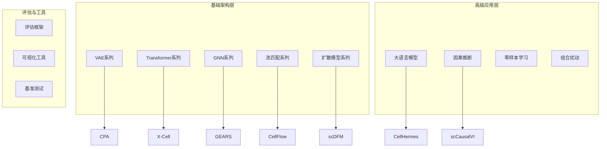
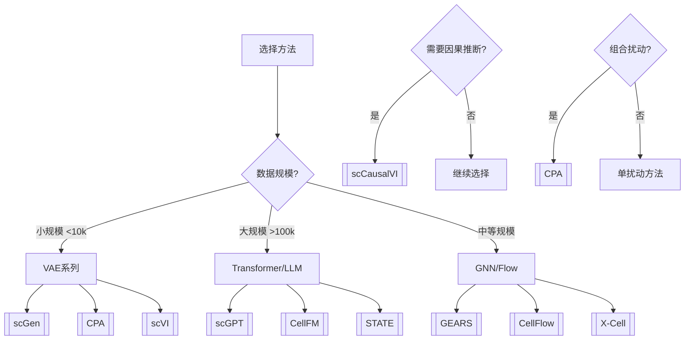

# 🔬 方法总地图 (Methods MOC)

> **AIVC Perturbation 预测方法全景导航**
> 
> 本知识库收录 **117+** 个扰动预测方法，按技术架构分类组织

---

## 🗺️ 方法网络概览



---

## 📊 按技术类型分组

### 🧬 VAE 系列 (scVI 生态)

基于变分自编码器的单细胞分析方法家族

| 核心方法 | 年份 | 关键创新 | 链接 |
|---------|------|---------|------|
| ![[scVI\|scVI]] | 2018 | VAE奠基，概率建模 | [[02-Methods/VAE/scVI\|scVI]] |
| ![[scGen\|scGen]] | 2019 | 首个扰动预测VAE | [[02-Methods/VAE/scGen\|scGen]] |
| ![[CPA\|CPA]] | 2023 | 组合扰动建模 | [[02-Methods/VAE/CPA\|CPA]] |
| ![[scANVI\|scANVI]] | 2019 | 半监督细胞注释 | [[02-Methods/Other/scANVI\|scANVI]] |
| ![[totalVI\|totalVI]] | 2020 | RNA+Protein联合建模 | [[02-Methods/VAE/totalVI\|totalVI]] |
| ![[MultiVI\|MultiVI]] | 2021 | 多组学整合 | [[02-Methods/VAE/MultiVI\|MultiVI]] |
| ![[scCausalVI\|scCausalVI]] | 2025 | 因果VAE + do-算子 | [[02-Methods/VAE/scCausalVI\|scCausalVI]] |
| ![[PerturbNet\|PerturbNet]] | 2024 | 扰动响应网络 | [[02-Methods/VAE/PerturbNet\|PerturbNet]] |
| ![[PerturbVAE-Pro\|PerturbVAE-Pro]] | 2025 | 专业扰动VAE | [[02-Methods/VAE/PerturbVAE-Pro\|PerturbVAE-Pro]] |
| ![[scREPA\|scREPA]] | 2025 | 表示学习 | [[02-Methods/VAE/scREPA\|scREPA]] |
| ![[CoupleVAE\|CoupleVAE]] | 2025 | 耦合VAE架构 | [[02-Methods/VAE/CoupleVAE\|CoupleVAE]] |

**相关概念**: [[Latent-Space]] | [[VAE-in-Single-Cell]] | [[Negative-Binomial]]

---

### 🤖 Transformer 系列

基于注意力机制的大规模预训练模型

| 核心方法 | 年份 | 关键创新 | 链接 |
|---------|------|---------|------|
| ![[STATE\|STATE]] | 2025 | 1.7亿细胞预训练 | [[02-Methods/Transformer/STATE\|STATE]] |
| ![[scBERT\|scBERT]] | 2023 | 基因BERT架构 | [[02-Methods/Transformer/scBERT\|scBERT]] |
| ![[scGPT\|scGPT]] | 2024 | 生成式预训练 | [[02-Methods/Transformer/scGPT\|scGPT]] |
| ![[scGPT-spatial\|scGPT-spatial]] | 2024 | 空间感知Transformer | [[02-Methods/Transformer/scGPT-spatial\|scGPT-spatial]] |
| ![[scLAMBDA\|scLAMBDA]] | 2024 | LLM入场单细胞 | [[02-Methods/Transformer/scLAMBDA\|scLAMBDA]] |
| ![[GeneCompass\|GeneCompass]] | 2024 | 基因指南针 | [[02-Methods/Transformer/GeneCompass\|GeneCompass]] |
| ![[CellFM\|CellFM]] | 2025 | 8亿参数RetNet | [[02-Methods/Transformer/CellFM\|CellFM]] |
| ![[scKGBERT\|scKGBERT]] | 2025 | 知识图谱增强BERT | [[02-Methods/Transformer/scKGBERT\|scKGBERT]] |
| ![[scPRAM\|scPRAM]] | 2025 | 预训练注意力模型 | [[02-Methods/Transformer/scPRAM\|scPRAM]] |
| ![[GeneMamba\|GeneMamba]] | 2025 | Mamba状态空间 | [[02-Methods/Transformer/GeneMamba\|GeneMamba]] |
| ![[CellCap\|CellCap]] | 2025 | 细胞Caption生成 | [[02-Methods/Transformer/CellCap\|CellCap]] |
| ![[TEARS\|TEARS]] | 2025 | 因果发现Transformer | [[02-Methods/Transformer/TEARS\|TEARS]] |

**相关概念**: [[Attention-Mechanism]] | [[Transformer-in-Single-Cell]] | [[Embedding]]

---

### 🌐 GNN 系列

图神经网络在基因调控网络中的应用

| 核心方法 | 年份 | 关键创新 | 链接 |
|---------|------|---------|------|
| ![[GEARS\|GEARS]] | 2023 | GNN+知识图谱 | [[02-Methods/GNN/GEARS\|GEARS]] |
| ![[Celcomen\|Celcomen]] | 2025 | 空间因果解耦 | [[02-Methods/GNN/Celcomen\|Celcomen]] |
| ![[NetPerturb\|NetPerturb]] | 2025 | 网络流预测 | [[02-Methods/GNN/NetPerturb\|NetPerturb]] |
| ![[scGNN\|scGNN]] | 2024 | 单细胞GNN | [[02-Methods/GNN/scGNN\|scGNN]] |
| ![[PerturbGNN\|PerturbGNN]] | 2025 | 扰动专用GNN | [[02-Methods/GNN/PerturbGNN\|PerturbGNN]] |

**相关概念**: [[GNN-in-Gene-Networks]] | [[Gene-Regulatory-Network]]

---

### 🌊 流匹配系列 (Flow Matching)

基于连续归一化流的生成模型

| 核心方法 | 年份 | 关键创新 | 链接 |
|---------|------|---------|------|
| ![[CellFlow\|CellFlow]] | 2024 | 流匹配最优传输 | [[02-Methods/Flow/CellFlow\|CellFlow]] |
| ![[CellFlow-Plus\|CellFlow-Plus]] | 2025 | 增强版CellFlow | [[02-Methods/Flow/CellFlow-Plus\|CellFlow-Plus]] |
| ![[CellFlux\|CellFlux]] | 2025 | 基于流的扰动预测 | [[02-Methods/Flow/CellFlux\|CellFlux]] |
| ![[CFM-GP\|CFM-GP]] | 2026 | 条件流匹配 | [[02-Methods/Flow/CFM-GP\|CFM-GP]] |
| ![[SCALE\|SCALE]] | 2025 | 大规模流模型 | [[02-Methods/Flow/SCALE\|SCALE]] |
| ![[scDFM\|scDFM]] | 2025 | 单细胞深度流 | [[02-Methods/Flow/scDFM\|scDFM]] |
| ![[DC-DSB\|DC-DSB]] | 2025 | 方向约束薛定谔桥 | [[02-Methods/Flow/DC-DSB\|DC-DSB]] |
| ![[Departures\|Departures]] | 2025 | 离差建模 | [[02-Methods/Flow/Departures\|Departures]] |

**相关概念**: [[Flow-Matching]] | [[Optimal-Transport]]

---

### 🎨 扩散模型系列

基于去噪扩散概率模型的生成方法

| 核心方法 | 年份 | 关键创新 | 链接 |
|---------|------|---------|------|
| ![[X-Cell\|X-Cell]] | 2026 | 49亿参数扩散语言模型 | [[02-Methods/Diffusion/X-Cell\|X-Cell]] |
| ![[scDiffusion-Perturb\|scDiffusion-Perturb]] | 2025 | 单细胞扩散扰动 | [[02-Methods/Diffusion/scDiffusion-Perturb\|scDiffusion-Perturb]] |
| ![[scPPDM\|scPPDM]] | 2025 | 扰动扩散模型 | [[02-Methods/Diffusion/scPPDM\|scPPDM]] |
| ![[PRESCIENT\|PRESCIENT]] | 2020 | 生成式细胞命运预测 | [[02-Methods/Other/PRESCIENT\|PRESCIENT]] |

**相关概念**: [[Diffusion-Models]] | [[Generative-Models]]

---

### 🗣️ 大语言模型系列 (LLM)

将自然语言处理技术应用于单细胞分析

| 核心方法 | 年份 | 关键创新 | 链接 |
|---------|------|---------|------|
| ![[CellHermes\|CellHermes]] | 2026 | 细胞语言模型 | [[02-Methods/LLM/CellHermes\|CellHermes]] |
| ![[scMulan\|scMulan]] | 2024 | 多任务生成式LLM | [[02-Methods/LLM/scMulan\|scMulan]] |
| ![[Geneformer\|Geneformer]] | 2023 | 基因Transformer | [[02-Methods/LLM/Geneformer\|Geneformer]] |
| ![[GenePT\|GenePT]] | 2023 | 基因提示学习 | [[02-Methods/LLM/GenePT\|GenePT]] |
| ![[scFoundation\|scFoundation]] | 2024 | 单细胞基础模型 | [[02-Methods/LLM/scFoundation\|scFoundation]] |
| ![[scLAMBDA\|scLAMBDA]] | 2024 | LLM单细胞分析 | [[02-Methods/Transformer/scLAMBDA\|scLAMBDA]] |
| ![[scKGBERT\|scKGBERT]] | 2025 | 知识图谱BERT | [[02-Methods/Transformer/scKGBERT\|scKGBERT]] |
| ![[CausalBERT\|CausalBERT]] | 2025 | 因果语言模型 | [[02-Methods/Other/CausalBERT\|CausalBERT]] |

**相关概念**: [[Embedding]] | [[Zero-Shot-Learning]]

---

### 🔗 因果推断系列

因果发现与干预效应估计方法

| 核心方法 | 年份 | 关键创新 | 链接 |
|---------|------|---------|------|
| ![[CausCell\|CausCell]] | 2025 | 细胞因果发现 | [[02-Methods/Causal-Inference/CausCell-2025\|CausCell-2025]] |
| ![[scCausalVI\|scCausalVI]] | 2025 | 因果VAE | [[02-Methods/Causal-Inference/scCausalVI-2025\|scCausalVI-2025]] |
| ![[CINEMA-OT\|CINEMA-OT]] | 2024 | 因果最优传输 | [[02-Methods/Causal-Inference/CINEMA-OT\|CINEMA-OT]] |
| ![[CASCADE\|CASCADE]] | 2024 | 因果发现 | [[02-Methods/Other/CASCADE\|CASCADE]] |
| ![[scCausalGP\|scCausalGP]] | 2025 | 因果高斯过程 | [[02-Methods/Other/scCausalGP\|scCausalGP]] |
| ![[TEARS\|TEARS]] | 2025 | 因果发现Transformer | [[02-Methods/Transformer/TEARS\|TEARS]] |
| ![[CausalBERT\|CausalBERT]] | 2025 | 因果语言模型 | [[02-Methods/Other/CausalBERT\|CausalBERT]] |

**相关概念**: [[Causal-Inference]] | [[Gene-Regulatory-Network]]

---

### 🧪 组合扰动系列

多基因/多药物组合效应预测

| 核心方法 | 年份 | 关键创新 | 链接 |
|---------|------|---------|------|
| ![[CPA\|CPA]] | 2023 | 组合扰动VAE | [[02-Methods/VAE/CPA\|CPA]] |
| ![[GPerturb\|GPerturb]] | 2025 | 图神经网络组合预测 | [[02-Methods/Combinatorial/GPerturb-2025\|GPerturb-2025]] |
| ![[PDGrapher\|PDGrapher]] | 2025 | 扰动图网络 | [[02-Methods/Combinatorial/PDGrapher\|PDGrapher]] |
| ![[MultiPerturb\|MultiPerturb]] | 2025 | 多扰动建模 | [[02-Methods/Other/MultiPerturb\|MultiPerturb]] |
| ![[MIX-CRISPR\|MIX-CRISPR]] | 2024 | CRISPR组合筛选 | [[02-Methods/Other/MIX-CRISPR\|MIX-CRISPR]] |
| ![[Mixscape\|Mixscape]] | 2020 | 混合效应建模 | [[02-Methods/Other/Mixscape\|Mixscape]] |

**相关概念**: [[Combinatorial-Perturbation]]

---

### 🎯 零样本学习系列

未见扰动的预测能力

| 核心方法 | 年份 | 关键创新 | 链接 |
|---------|------|---------|------|
| ![[PertAdapt\|PertAdapt]] | 2025 | 扰动自适应 | [[02-Methods/Zero-Shot/PertAdapt\|PertAdapt]] |
| ![[scUnify\|scUnify]] | 2025 | 统一表示学习 | [[02-Methods/Zero-Shot/scUnify\|scUnify]] |
| ![[scDCA\|scDCA]] | 2025 | 领域自适应 | [[02-Methods/Zero-Shot/scDCA\|scDCA]] |
| ![[PertEval-scFM\|PertEval-scFM]] | 2025 | 基础模型评估 | [[02-Methods/Zero-Shot/PertEval-scFM\|PertEval-scFM]] |
| ![[UCE\|UCE]] | 2024 | 跨物种通用嵌入 | [[02-Methods/Other/UCE\|UCE]] |

**相关概念**: [[Zero-Shot-Learning]]

---

### 📊 评估与基准系列

| 核心方法 | 年份 | 关键创新 | 链接 |
|---------|------|---------|------|
| ![[Systema\|Systema]] | 2025 | 系统评估框架 | [[02-Methods/Evaluation/Systema\|Systema]] |
| ![[Nature-Methods-Benchmark\|Nature-Methods-Benchmark]] | 2025 | NM基准测试 | [[02-Methods/Evaluation/Nature-Methods-Benchmark\|Nature-Methods-Benchmark]] |
| ![[scPerturb-Benchmark\|scPerturb-Benchmark]] | 2025 | 扰动基准 | [[02-Methods/Other/scPerturb-Benchmark\|scPerturb-Benchmark]] |
| ![[SCPERTURB\|SCPERTURB]] | 2023 | 扰动数据库 | [[02-Methods/Other/SCPERTURB\|SCPERTURB]] |
| ![[Perturb-Viz\|Perturb-Viz]] | 2024 | 可视化平台 | [[02-Methods/Other/Perturb-Viz\|Perturb-Viz]] |
| ![[CAUSALBENCH\|CAUSALBENCH]] | 2024 | 因果基准 | [[02-Methods/Other/CAUSALBENCH\|CAUSALBENCH]] |

**相关概念**: [[Benchmark]]

---

## 🔍 查询与过滤建议

### Dataview 风格查询示例

```dataview
// 按年份筛选方法
table year, category, key-innovation
from "02-Methods"
where year = 2025
sort category asc
```

```dataview
// 查找特定技术类型的所有方法
list
from "02-Methods"
where contains(category, "Transformer")
sort year desc
```

```dataview
// 按标签查找因果相关方法
table year, title
from "02-Methods"
where contains(tags, "causal")
sort year desc
```

### 常用搜索模式

| 搜索目标 | 关键词/标签 |
|---------|------------|
| 最新方法 (2025+) | `#2025` `#2026` |
| 因果推断方法 | `#causal` `#causal-inference` |
| 基础模型 | `#foundation-model` `#llm` |
| 组合扰动 | `#combinatorial` `#multi-perturbation` |
| 评估工具 | `#benchmark` `#evaluation` |
| 可视化 | `#visualization` |

---

## 🎯 快速决策路径



---

## 🔗 相关MOC

- [[Concepts-MOC]] - 核心概念网络
- [[Getting-Started]] - 入门指南
- [[01-Maps/method-map\|方法地图]] - 可视化方法全景
- [[04-Concepts/method-selection-guide\|方法选择指南]] - 详细决策流程
- [[04-Concepts/method-comparison-matrix\|方法对比矩阵]] - 横向对比表

---

*最后更新: 2026-03-31 | 方法数量: 117+*