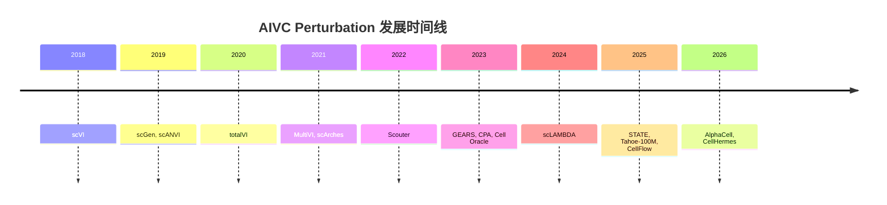

# 时间线 (Timeline)

> AIVC Perturbation 预测发展历程

## 2018 - 变分推断奠基

- **scVI** (2018.12)
  - 单细胞变分推断奠基性工作
  - 机构: UC Berkeley (Nir Yosef Lab)
  - 影响: 催生了整个scvi-tools生态系统

## 2019 - 奠基之年

- **scANVI** (2019.08)
  - 半监督单细胞注释
  - 机构: UC Berkeley
  
- **scGen** (2019.04)
  - 首个 ML 工具用于单细胞扰动预测
  - VAE 架构
  - 机构: Helmholtz

## 2020-2021 - 多模态与迁移

- **totalVI** (2020)
  - 首个RNA+Protein联合建模
  - 机构: UC Berkeley / UCSF

- **MultiVI** (2021)
  - 多组学马赛克整合
  - 机构: UC Berkeley / Genentech

- **scArches** (2021)
  - 单细胞迁移学习框架
  - 机构: Helmholtz / UC Berkeley

- **Perturb-seq** 大规模应用
- **sci-Plex** 化合物扰动图谱
- 数据基础设施建设期

## 2022 - 方法爆发前夜

- **Scouter** (2022)
  - 单细胞扰动统计框架
  - 机构: Cambridge

- 组合扰动数据发布 (Norman 2021)
- 深度学习开始主导

## 2023 - 百花齐放

| 时间 | 方法 | 机构 | 突破 |
|------|------|------|------|
| 2023 | **GEARS** | Stanford | GNN + 知识图谱 |
| 2023 | **CPA** | FAIR/Theis | 组合扰动自编码器 |
| 2023 | **Cell Oracle** | WashU | GRN + 计算机模拟 |

## 2024 - LLM 入场

- **scLAMBDA** (2024)
  - Yale
  - 大语言模型用于单细胞

## 2025 - 虚拟细胞元年 ⭐

| 时间 | 方法 | 机构 | 突破 |
|------|------|------|------|
| 2025.01 | **STATE** | Arc Institute | 1.7亿细胞，Transformer |
| 2025 | **Tahoe-100M** | Arc Institute | 1亿扰动图谱 |
| 2025 | **CellFlow** | Theis Lab | 流匹配 + 最优传输 |

## 2026 - 中国突破 🇨🇳

| 时间 | 方法 | 机构 | 突破 |
|------|------|------|------|
| 2026.03 | **AlphaCell** | 同济 DELTA | 虚拟细胞世界模型 |
| 2026.03 | **CellHermes** | 同济 DELTA | 细胞语言模型 |

## 2025-2026 前沿动态

### 2025 重要进展
- **Tahoe-x1**: Arc Institute发布1亿细胞扰动图谱
- **流匹配方法**: CellFlow等基于流匹配的生成模型兴起
- **多模态整合**: 转录组+蛋白质+代谢组联合建模

### 2026 预期方向
- **空间转录组扰动**: 空间分辨率的扰动预测
- **实时预测**: 动态细胞状态预测
- **临床转化**: 从基础研究走向临床应用

## 未来展望

- [ ] 多模态整合 (转录组 + 蛋白质组 + 代谢组)
- [ ] 空间转录组扰动预测
- [ ] 实时细胞状态预测
- [ ] 跨物种泛化
- [ ] 临床转化应用

---

---

*最后更新: 2026-03-29*
