# 单细胞扰动预测方法关联图谱

> 本文档使用 Mermaid 语法绘制方法之间的关联关系
> 生成时间: 2026-03-29

---

## 一、方法技术演进路径

### 1.1 整体技术演进时间线

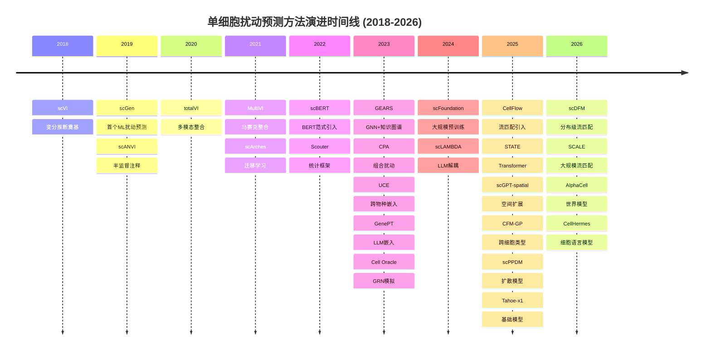

---

## 二、方法架构分类图谱

### 2.1 架构类型分布

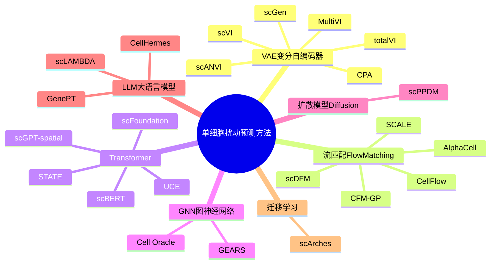

---

## 三、方法继承与发展关系

### 3.1 scVI 生态系统

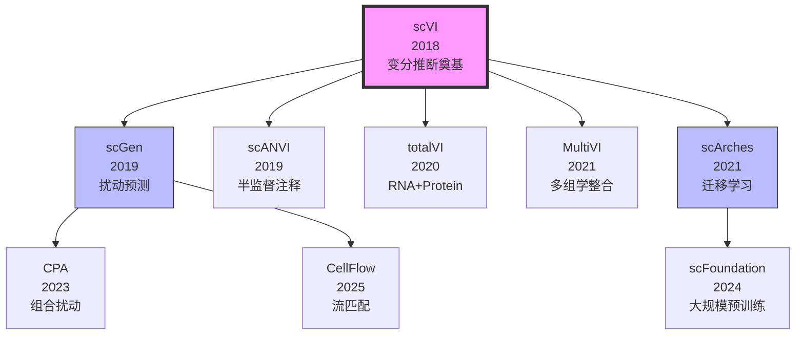

### 3.2 流匹配方法家族

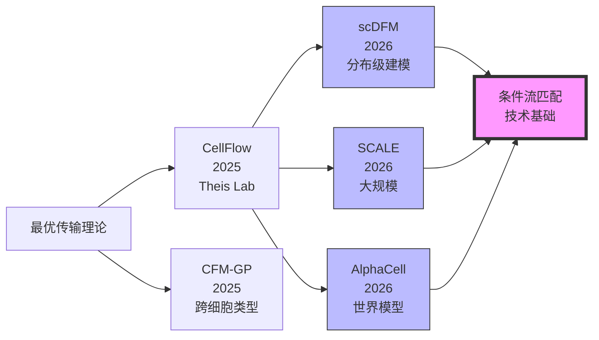

### 3.3 Transformer方法演进

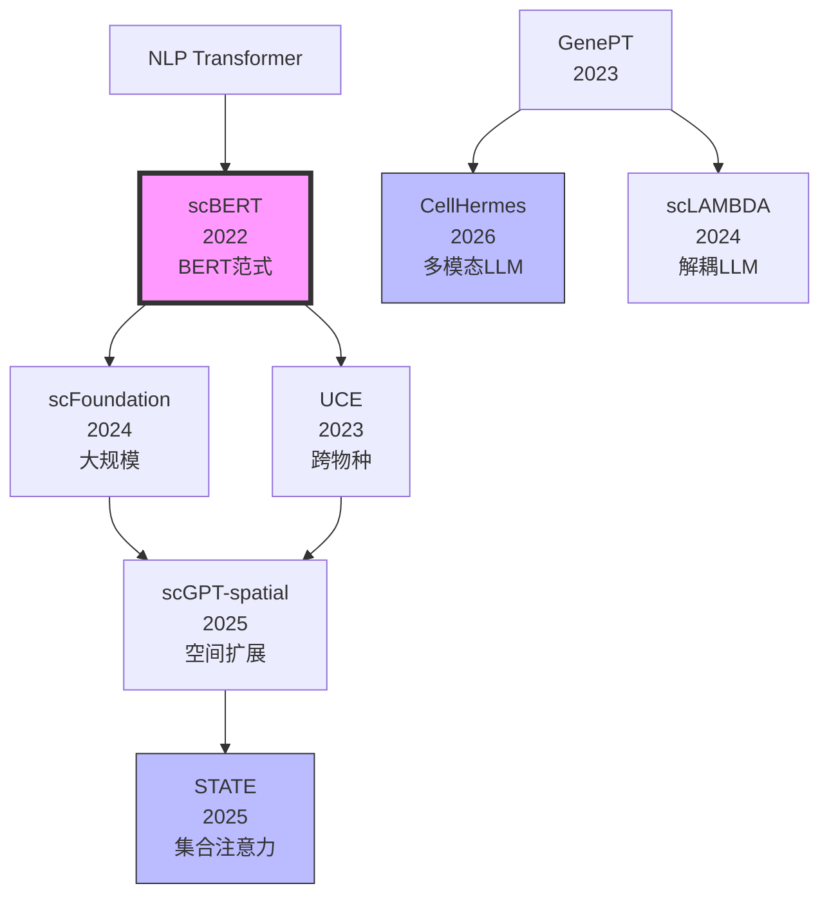

---

## 四、团队/机构合作网络

### 4.1 主要研究团队关系

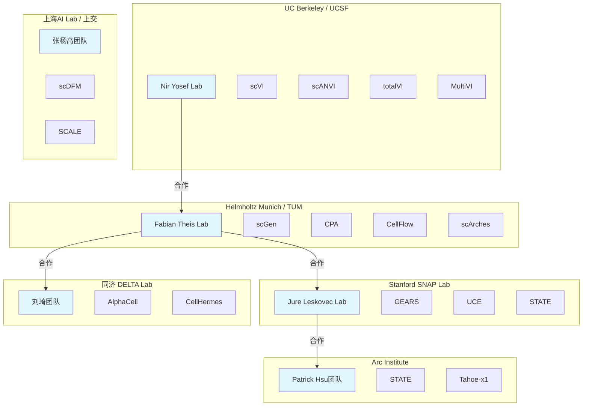

### 4.2 国际合作关系

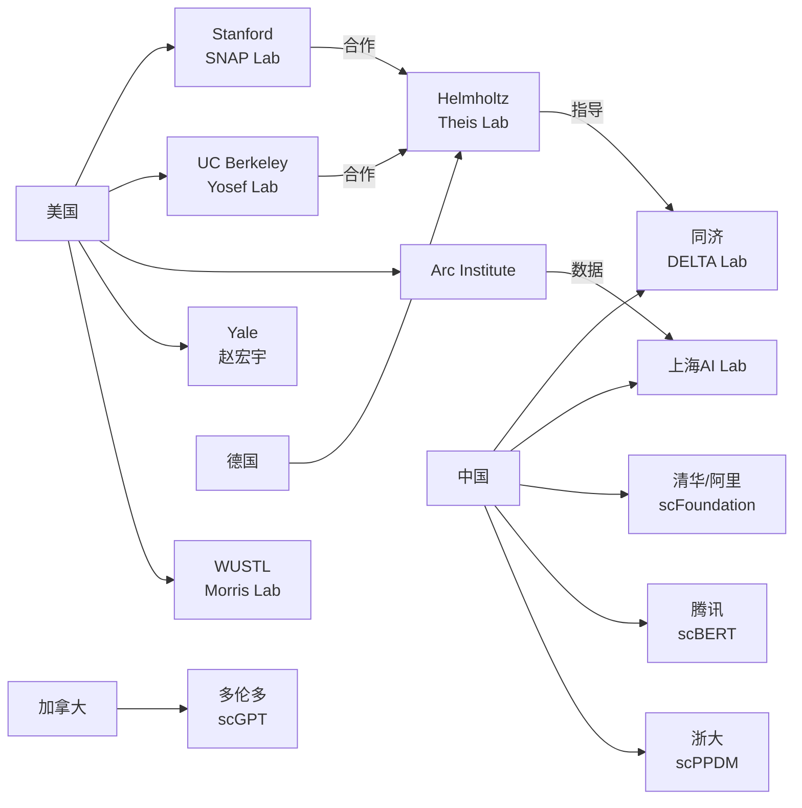

---

## 五、技术组件依赖关系

### 5.1 核心技术组件

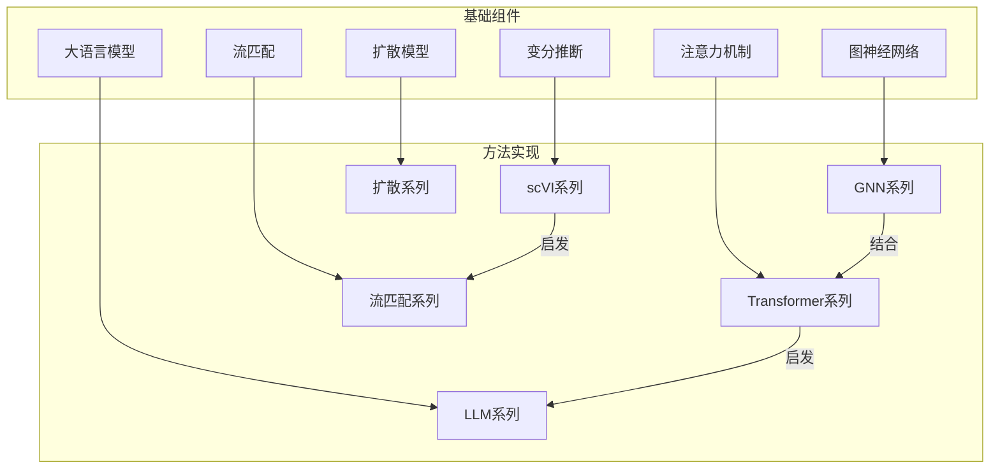

### 5.2 数据流与工具链

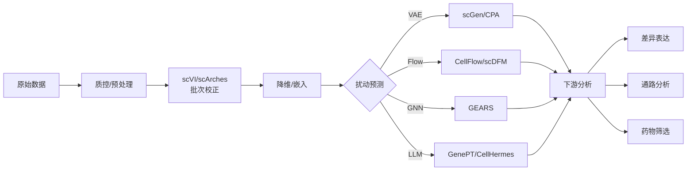

---

## 六、方法对比矩阵关系

### 6.1 架构 vs 能力矩阵

```mermaid
quadrantChart
    title 方法架构与能力分布
    x-axis 低可解释性 --> 高可解释性
    y-axis 低预测精度 --> 高预测精度
    
    quadrant-1 高精度+高可解释: 理想区域
    quadrant-2 高精度+低可解释: 黑盒模型
    quadrant-3 低精度+低可解释: 待改进
    quadrant-4 低精度+高可解释: 基础方法
    
    scVI: [0.6, 0.5]
    scGen: [0.5, 0.6]
    CPA: [0.6, 0.7]
    GEARS: [0.7, 0.7]
    CellFlow: [0.6, 0.8]
    scDFM: [0.5, 0.85]
    SCALE: [0.4, 0.9]
    STATE: [0.5, 0.9]
    Cell Oracle: [0.9, 0.6]
    GenePT: [0.7, 0.5]
    CellHermes: [0.6, 0.7]
```

---

## 七、应用领域映射

### 7.1 应用场景分类

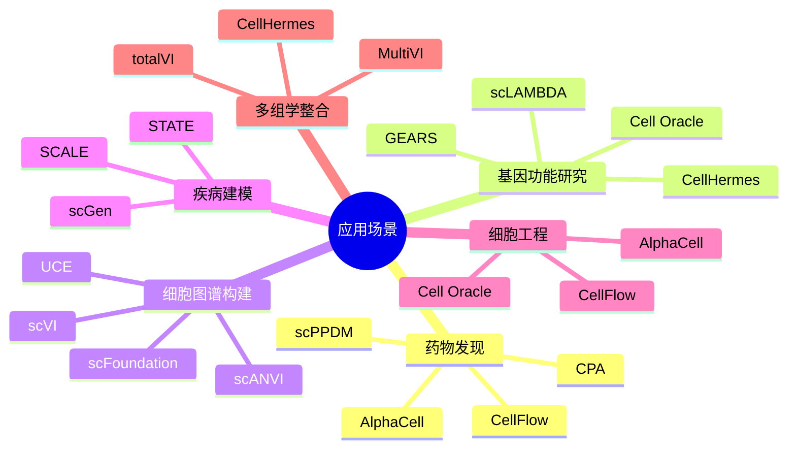

---

## 八、方法选择决策树

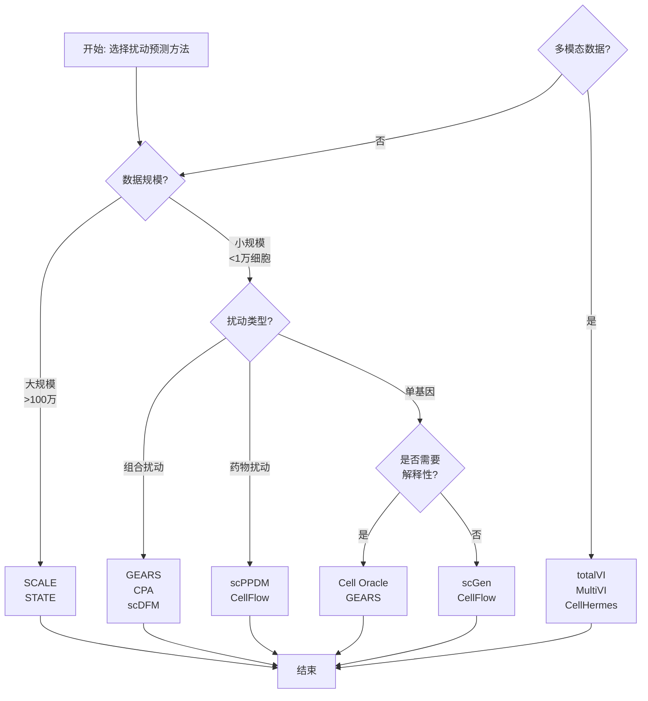

---

## 九、未来发展趋势

### 9.1 技术融合趋势

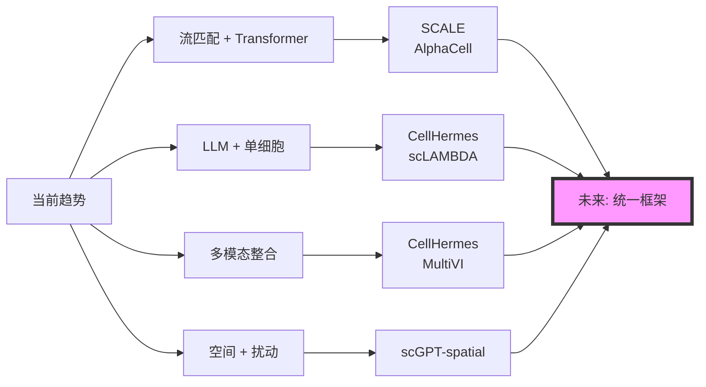

---

*文档生成时间: 2026-03-29*
*版本: v1.0*
